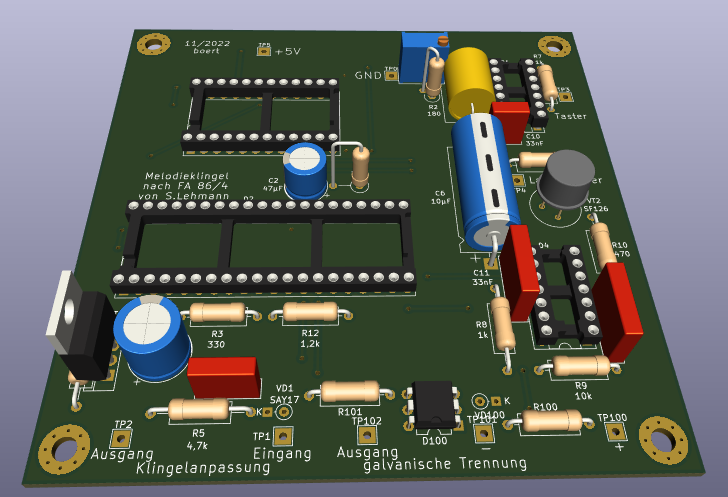

# Melodieklingel

Leiterplatte für die Melodieklingel nach der Veröffentlichung von S. Lehmann im Funkamateur 4/86

## Eckdaten
Leiterplattengröße: 100 x 100 mm  
Betriebsspannung: 5V DC  
Stromaufnahme: 183 bis 230 mA (TTL)  
Schaltschwelle (Transistor):   1,4 V  
Schaltschwelle (Optokoppler):  8 V (DC) oder 5,6 V (AC)    

### Stromaufnahme (Bestückung mit TTL-Schaltkreisen)

Abschätzung:  

| Ref. | Schaltkreis | Stromaufnahme |
| ---- | ----------- | -------------:|
| D1   | D104        |  30 mA        |
| D2   | U880D       | 200 mA        |
| D3   | U2716       |  25 mA        |
| D4   | D174        |  30 mA        |
|      | **Summe**   | 285 mA        |

Messung:  

Betriebsmodus | Stromaufnahme | Leistung |
------------- | -------------:| --------:|
Ruhezustand   |        183 mA | 0,92 W   |
Wiedergabe    |        230 mA | 1,15 W   |

### erwartete Stromaufnahme (Bestückung mit CMOS-Bausteinen)

| Ref. | Schaltkreis | erwartete Stromaufnahme |
| ---- | ----------- | ----------------------- |
| D1   | 74HCT04     |   0,002 mA              |
| D2   | TMPZ84C00   |  15     mA              |
| D3   | 27C16       |   1     mA              |
| D4   | 74HCT74     |   0,04  mA              |
|      | **Summe**   |  16     mA              |

Leistungsaufnahme: ca. 80 mW

## Änderungen gegenüber dem Original
- zusätzliche Bestückungsvariante mit Optokoppler zur galvanischen Trennung des Klingel
- Werte und Baugrößen an vorhandenen Lagerbestand angepasst
- alle liegenden Widerstände auf 15 mm Rastermaß geändert
- Stützkondensator für U880D ergänzt

## Bestückungsvarianten
### Taster
Dieser wird zwischen den Lötpunkten 'Start' und 'GND' angeschlossen.
Da keine galvansiche Trennung und Entstörung vorliegt, eignet sich diese Variante nur für denn Fall, das der Taster mit einer kurzen Leitung angschlossen wird, z.B. bei einer Montage im Gehäuse.

Folgende Bauteile können bei der Bestückung entfallen:  
C3, C4, R5, R6, VD1, VT1  
sowie:  
R100, R101, D100, VD100  

### Transistor
Bei dieser Variante hilft ein Tiefpass und ein Transistor beim Auslösen der Klingel. Es muß eine Verbindung zwischen TP2 und TP3 hergetellt werden.
Als Transistor für VT1 eignet sich jeder beliebige Kleinsignal-NPN-Typ, z.B. SC236, SF126, SF136, SF357, SS125, SS216.

Folgende Bauteile können bei der Bestückung entfallen:  
R100, R101, D100, VD100  

### Optokoppler
Hier wird ein Optokoppler zur galvaischen Trennung genutzt.
Um diese Variante zu Nutzen muß eine Verbindung zwischen TP102 und TP3 hergetellt werden.  
Zum Auslösen der Klingel dient die Gleich- oder Wechselspannung der vorhandenen Klingelanlage. Die Klingel wird mit einem Signal ab 8 V Gleichspannung oder ab 5,6 V Wechselspannung aktiviert. Über den Widerstand R100 kann die Schaltschwelle angepasst werden.  

Der Widerstand R7 sollte ggf. auf 47 kOhm erhöht werden, damit der Pegel am Gatter D1B passt.  
Folgende Bauteile können bei der Bestückung entfallen:  
C3, C4, R5, R6, VD1, VT1  

## Links
https://hc-ddr.hucki.net/wiki/doku.php/elektronik/melodieklingel

# Änderungen / History
## Version 2, 29.11.2022
- C1 von 470 nF zu 470 pF geändert   
- D100, Pin 5 und Pin 6 getauscht   
